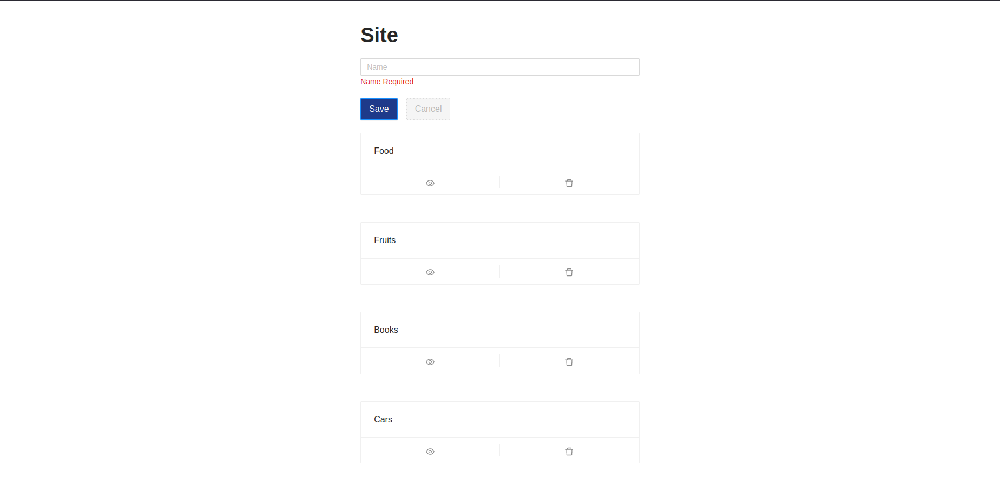
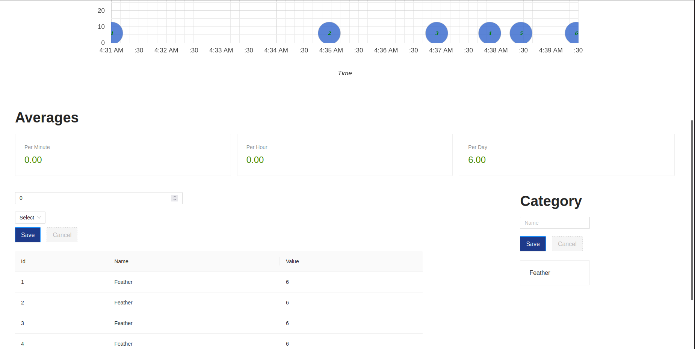

# Metric App FrontEnd

## ScreenShot
  
  

##### Description
- This app gives user the ability to add metrics for each site, which will be visualized upon creation.
- This project encompasses about three main components which is the Site , Metric & Category, each of this component has its own directory.
- In order to use this application you need to first create a site then a category and lastly a metric which will be displayed on a chart.

##### How to use
```
yarn install
```

```
yarn start
```

##### Test

```
yarn run cypress:open
```


## Technologies Used
- Typescript for type checking
- Cypress for integration test
- React google chart
- Antd is a UI library 
- Tailwind 
- Eslint
- Yulp

## Requirements

- [x] The user must be able to post and visualize metrics.
- [x] The metric will have a Timestamp, name(Category), and value.
- [x] The user should see the metrics in a timeline
- [x] The user should see averages per minute/hour/day

##### Future Prospect
- Write a more cleaner and robust integration and unit test
- Make the application have the ability to add random values 
